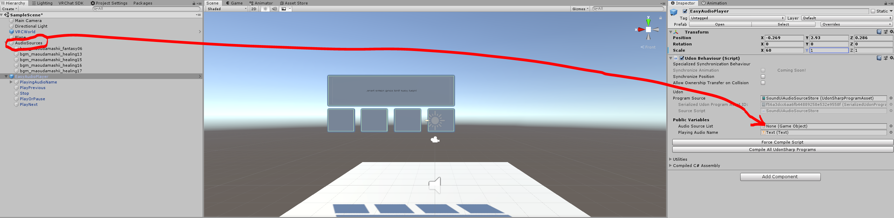

## 導入手順

1. 下記をインポート（インポート済みのものは、手順を省略してください）
    - VRCSDK3-WORLD
    - UdonSharp
1. 本プレイヤーに入れたい音楽を、プロジェクトにコピー（D&D）  
   
1. Hierarchyを右クリックで、Empty GameObjectを作成  
   
    - ここではこのオブジェクトを「AudioSources」とリネームしておく（自由な名前で大丈夫です）
    - 以下、ここでは**AudioSources**と呼称します
1. AudioSourcesに、上記で入れた音楽分の個数、AudioSourceを作成  
   
1. 各AudioSourceのClipに、それぞれの音楽を指定（D&D）  
   
1. 各AudioSourceを、曲名にリネーム　　
   
   - この名前が、本プレイヤーの曲名表示オブジェクトに表示されます
1 リネームした各AudioSourceを全て選択して、Inspectorの'Play On Awake'のチェックを**外す**
   
1. EasyAudioPlayer.unitypackageをインポート  
   
1. `galaxy-sixth-sensey\EasyAudioPlayer\EasyAudioPlayer.prefab`をHierarchyに配置
1. EasyAudioPlayerのScaleのxを60くらいに調整  
   
1. 'Compile All UdonSharp Programs' を押下
1. EasyAudioPlayerをクリックして、Inspectorの'Audio Source List'に**AudioSources**を指定  
   

## ワールドのBGMを設定する

1. TODO
