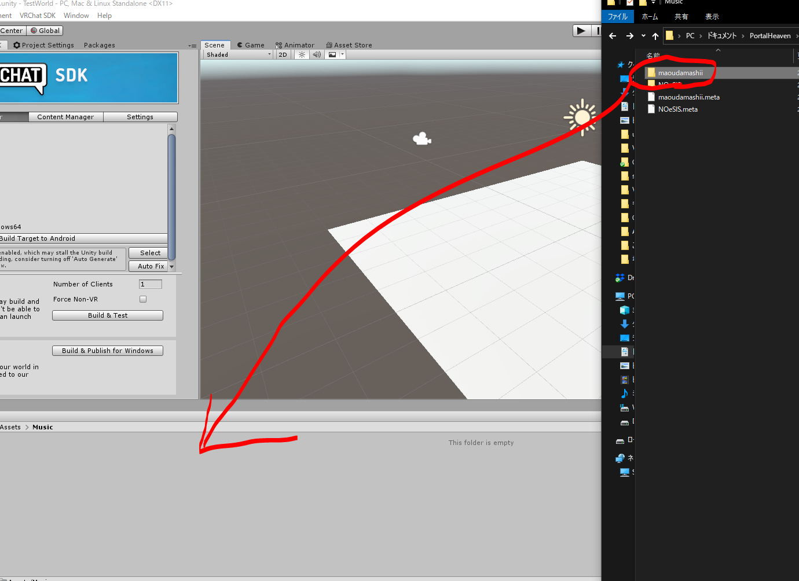
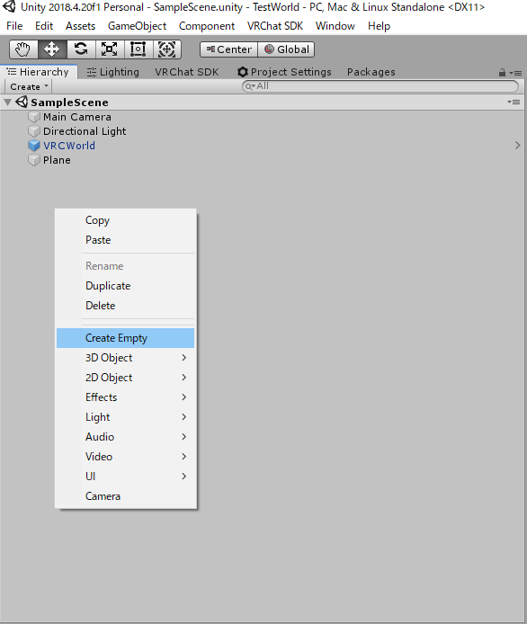
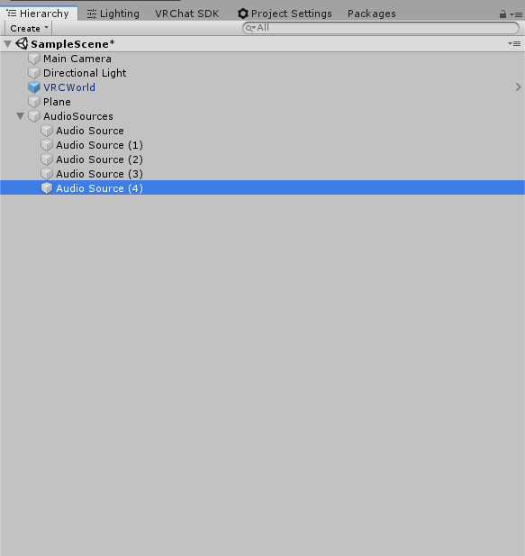
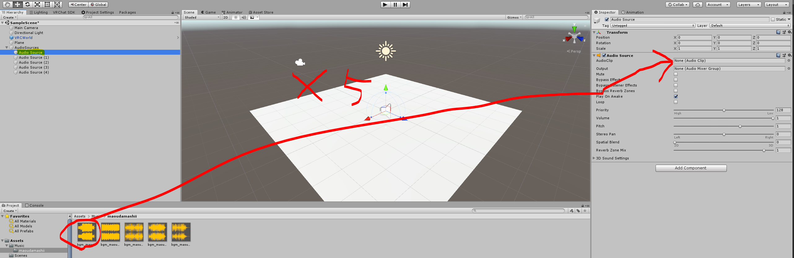
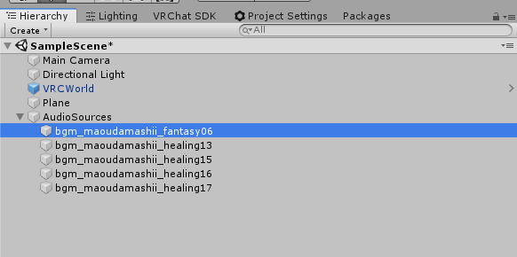
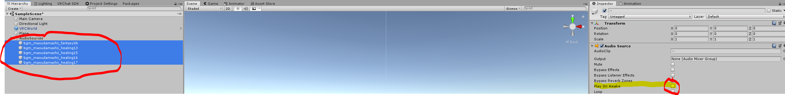
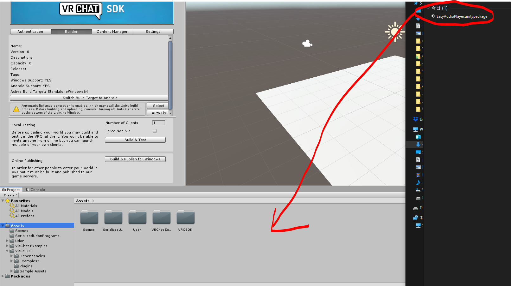
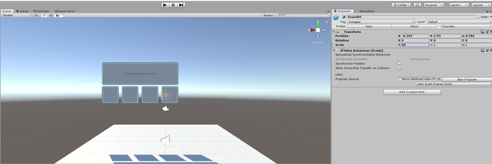

## ライセンス

MITライセンス

- [開発用リポジトリ - VRChat-EasyAudioPlayer](https://github.com/aiya000/VRChat-EasyAudioPlayer)

## 導入手順

1. 下記をインポート（インポート済みのものは、手順を省略してください）
    - VRCSDK3-WORLD
    - UdonSharp
    - 下記「曲名」に日本語を使いたい場合は、下記アセットが使えるかもしれません
        - [Selected U3D Japanese Font](https://assetstore.unity.com/packages/2d/fonts/selected-u3d-japanese-font-337)
1. 本プレイヤーに入れたい音楽を、プロジェクトにコピー（D&D）  
   
1. Hierarchyを右クリックで、Empty GameObjectを作成  
   
    - ここではこのオブジェクトを「AudioSources」とリネームしておく（自由な名前で大丈夫です）
    - 以下、ここでは**AudioSources**と呼称します
1. AudioSourcesに、上記で入れた音楽分の個数、AudioSourceを作成  
   
1. 各AudioSourceのClipに、それぞれの音楽を指定（D&D）  
   
1. 各AudioSourceを、曲名にリネーム  
   
   - この名前が、本プレイヤーの曲名表示オブジェクトに表示されます
1. リネームした各AudioSourceを全て選択して、Inspectorの'Play On Awake'のチェックを**外す**  
   
   - ここで'Loop'のチェックを入れておくと各曲がループし、曲を終えたときに次の曲に移さなくなります
1. EasyAudioPlayer.unitypackageをインポート  
   
1. `galaxy-sixth-sensey\EasyAudioPlayer\EasyAudioPlayer.prefab`をHierarchyに配置
1. 'Compile All UdonSharp Programs' を押下
1. EasyAudioPlayerをクリックして、Inspectorの'Audio Source List'に**AudioSources**を指定  
   
1. 必要に応じて、下記などを調節（操作によって、HierarchyのEasyAudioPlayerを'Unpack prefab'する必要があります）
    - EasyAudioPlayerと、その子コンポーネントのScale
    - EasyAudioPlayerと、その子コンポーネントのMaterial
    - 等

完了！

- - - - -

設定済み完成例

- - - - -

## ワールドのBGMを設定する

ワールドのBGMを設定したい場合は、プレイヤーに設定を合わせる必要があります。

1. ワールドに設定したいBGM用のAudioSourceを、AudioSourcesの子オブジェクトとして作成する
1. AudioSourceを設定する
1. AudioSourceの名前に曲名を設定する
1. AudioSourceに'Play On Awake'のチェックを**入れる**
1. お好みで、AudioSourceに'Loop'のチェックを**入れる**
1. EasyAudioPlayerを'Unpack prefab'する
1. Hierarchyの`EasyAudioPlayer > PlayingAudioName > Canvas > Text`をクリック
1. Inspectorの`Text`に、設定したAudioSourceの曲名を入力する

ありがとう！
